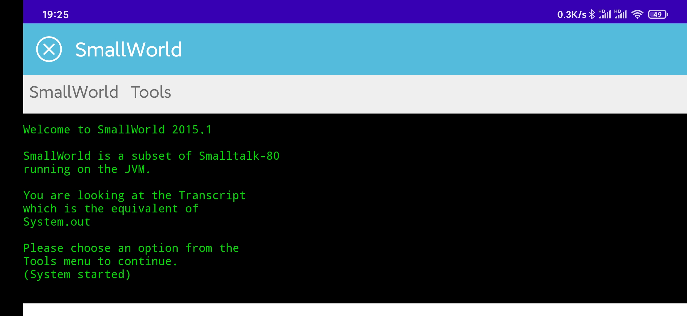
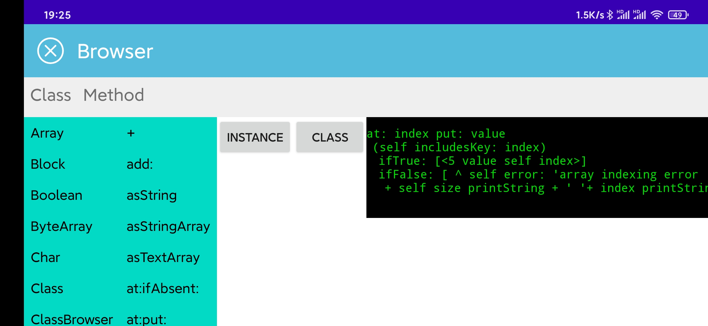
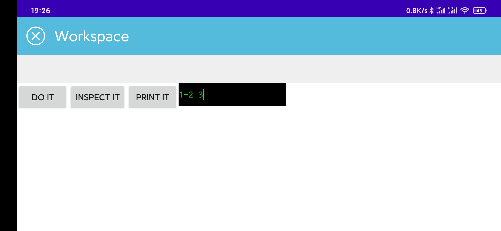

# Robotalk

A Proof of concept that Smalltalk can be embedded in Android applications.

## Note
The Smallworld's source code is forked from [russellallen/SmallWorld](https://github.com/russellallen/SmallWorld)

Improvements:
1. To fit Android App architecture, moving UI stuff into spearate thread
2. Adding implementation of "Virtual-View", remove all UI dependencies from interpreter.